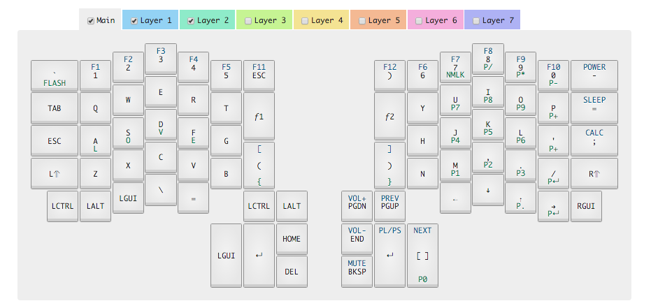

# Ergodox Infinity Layout
There are many layouts but this one is mine.



I use this one quick trick to program the keys without an additional keyboard
```bash
sleep 5 && dfu-util -D left_kiibohd.dfu.bin
# put keyboard into debug mode
```
